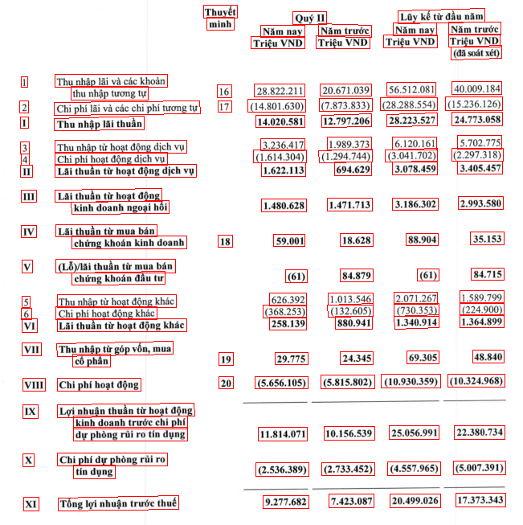
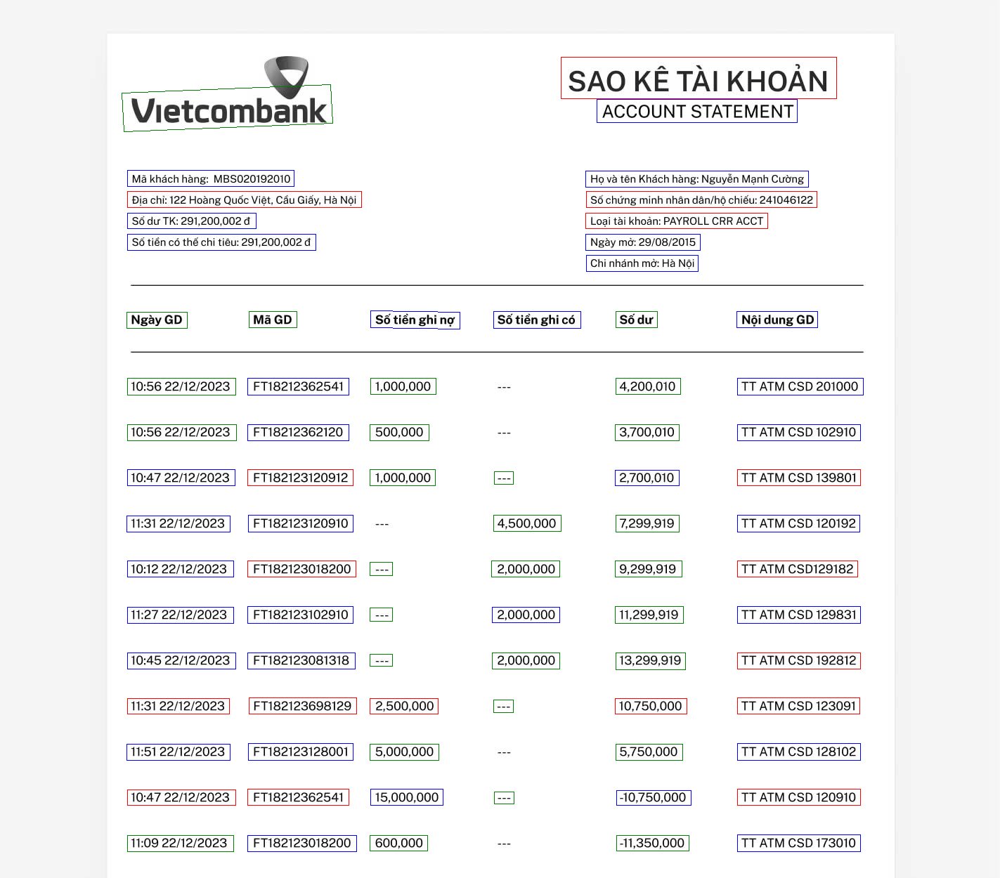
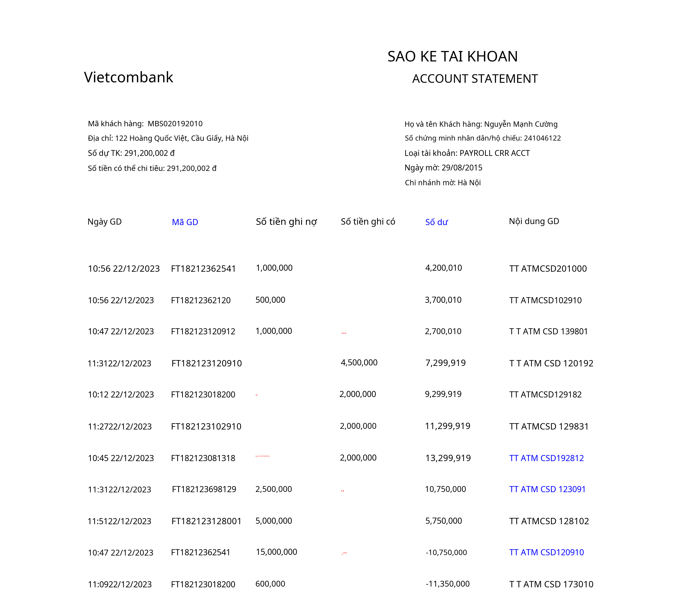

## Text Line Detection
- Model nhận đầu vào là ảnh sau khi đã qua xử lý
- Model detect ra line text, sau đó đưa ra kết quả tọa độ của các line

- Kết quả được lưu lại thành file `result_det.json`. Mỗi giá trị sẽ là một danh sách các từ điển, mỗi từ điển trên mỗi trang của tài liệu đầu vào.

- Các key bao gồm:
    -  `bboxes`: detect ra bounding boxes cho text
        - `bbox`: hình chữ nhật căn chỉnh theo trục cho dòng văn bản theo định dạng (x1, y1, x2, y2). (x1, y1) là góc trên cùng bên trái và (x2, y2) là góc dưới cùng bên phải.
        - `polygon`: tọa độ các đỉnh đa giác cho dòng văn bản theo định dạng (x1, y1), (x2, y2), (x3, y3), (x4, y4). Các điểm theo thứ tự theo chiều kim đồng hồ từ trên cùng bên trái.
        - `confidence`: độ tin cậy của model trong văn bản được phát hiện (0-1)

### Highlight

Highlight các tọa độ dựa vào `confidence` với các level:
- `confidence` >= 0.95 : màu đỏ 
- 0.9 <= `confidence` < 0.95 : màu xanh lam
- `confidence` < 0.9 : màu xanh lá

### Run Text Line Detection
`python detect_text.py`

## Text Recognition

- Model nhận đầu vào là tọa độ của các line text của model text line detection trả ra
- Kết quả của model recognition được lưu thành file 'result_reg.json'. Mỗi giá trị sẽ là một danh sách các từ điển, mỗi từ điển trên mỗi trang của tài liệu đầu vào.

- Các key bao gồm:
    - `text_lines`: text được phát hiện và các bounding box cho mỗi dòng
        - `text`: text trong dòng
        - `confidence`: độ tin cậy của model trong văn bản được phát hiện (0-1)
        - `polygon`: tọa độ các đỉnh đa giác cho dòng văn bản theo định dạng (x1, y1), (x2, y2), (x3, y3), (x4, y4). Các điểm theo thứ tự theo chiều kim đồng hồ từ trên cùng bên trái.
        - `bbox`: hình chữ nhật căn chỉnh theo trục cho dòng văn bản theo định dạng (x1, y1, x2, y2). (x1, y1) là góc trên cùng bên trái và (x2, y2) là góc dưới cùng bên phải.
        - `languages`: ngôn ngữ được chỉ định

### Đánh giá và phân tích model
- Đánh giá output của model recognition dựa trên 3 model:

    - `SuryaOCR`

    - `VietOCR`

    - `PaddleOCR`

- Kết quả cuối cùng được đánh giá dựa vào 2 tiêu chí của 3 model:
    - `Tiêu chí 1`: Dựa vào sự tương đồng của text của các model. Nếu có 2 model trả ra output có sự tương đồng cao nhất (99% - 100%), thì lựa chọn output đó.
    - `Tiêu chí 2`: Nếu cả 3 model trả ra các kết quả đều khác nhau, sẽ lựa chọn ra model có confidence cao nhất. 

### Highlight 

Highlight các tọa độ dựa vào `confidence` với các level:
- `confidence` >= 0.95 : màu đen 
- 0.9 <= `confidence` < 0.95 : màu xanh lam
- `confidence` < 0.9 : màu đỏ

### Run Text Recognition
`python ocr_text.py`

## Run Text Line Detection & Text Recogntion
`python implementModel.py`

## Cài đặt môi trường
- Cài đặt môi trường dựa vào [Dockerfile](Dockerfile)

